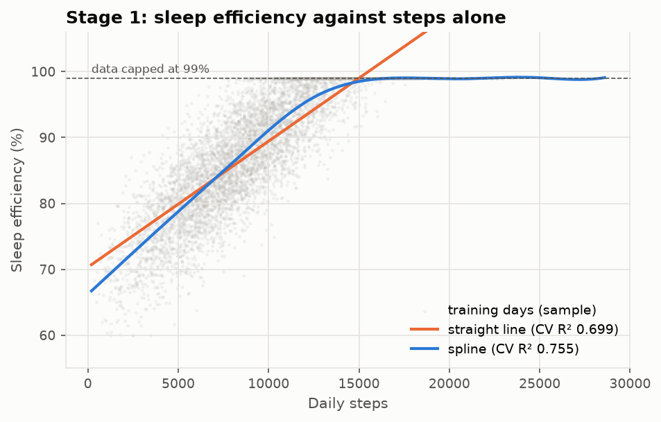
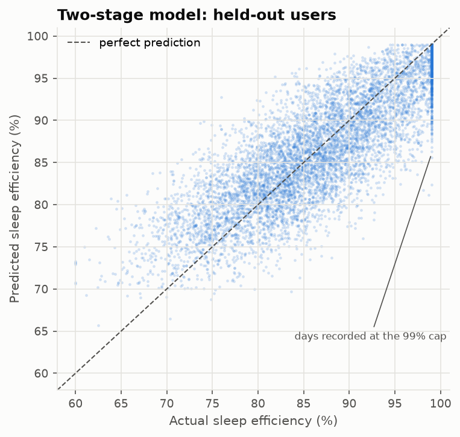
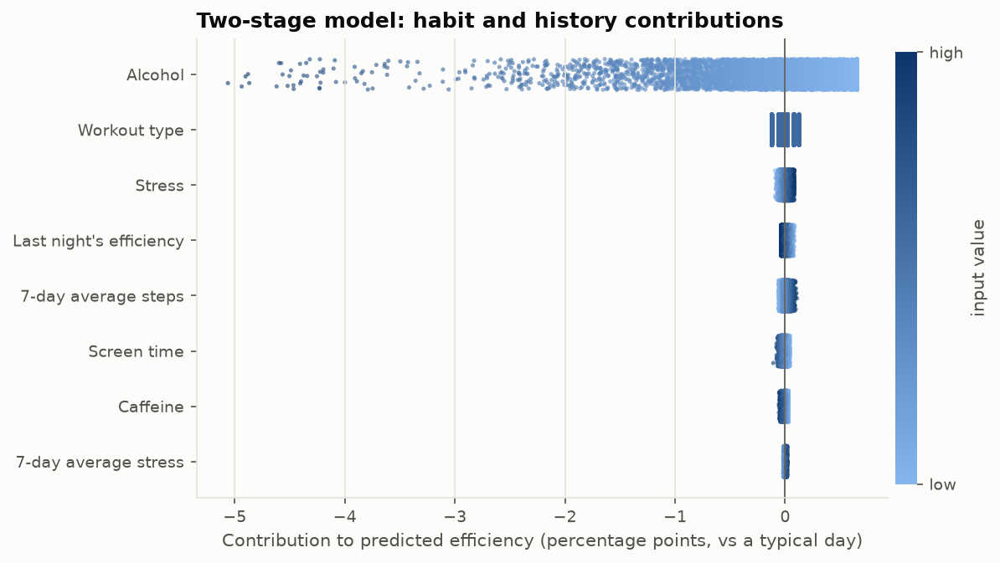
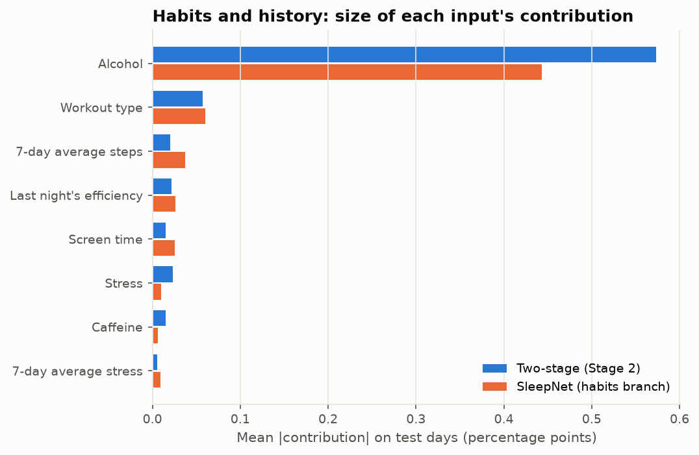

# Sleep Efficiency Predictor

A modeling study of how daily activity and habits are associated with nightly sleep efficiency,
with a Streamlit app that splits each prediction into an **activity** part and a **habits** part.

> **Not medical advice.** The model is trained on a **synthetic** dataset. Its outputs describe
> patterns in generated data, not in real people, and every relationship below is an
> association, not a cause.

**Live app:** _add your Streamlit Community Cloud link here after deploying (see
[Deploy](#deploy))._

## Question

How much of a night's sleep efficiency can be predicted from that day's activity and habits,
for a person the model has never seen? And how much do habits add beyond how much someone walked?

## Data

[Health + Wearables + Stress/Sleep Tracking (syntc)](https://www.kaggle.com/datasets/mftnakrsu/health-wearables-stresssleep-tracking-syntc)
on Kaggle, file `wearables_health_6mo_daily.csv`. It holds 300 users × 184 days (55,200 rows)
of steps, heart rate, stress, caffeine, alcohol, screen time, workouts and sleep measures. The
dataset is synthetic, which the title's "syntc" marks, and the data itself shows it: sleep
efficiency is capped at exactly 0.99 on 18% of days.

The CSV is not in this repository. To reproduce the results:

1. Download the dataset from Kaggle.
2. Put `wearables_health_6mo_daily.csv` in a `data/` folder at the repository root. The folder
   is git-ignored.

## Method

1. **Grouped evaluation.** Users are split 70/15/15 into train, validation and test sets, so no
   person appears in more than one set. All cross-validation and tuning uses `GroupKFold(5)`
   over training users, and Lasso feature selection sees training users only. The original
   notebook split rows at random; that scored the same model 0.757 instead of 0.725.
2. **No leakage.** Other measurements of the same night's sleep (duration, latency, wake time,
   sleep stages) and same-day mood are never inputs.
3. **Lag features.** Each user's previous night's efficiency, and 7-day averages of steps and
   stress, are computed from earlier days only (`.shift(1)`).
4. **Two-stage model.** Stage 1 fits a spline on steps alone. Stage 2 fits habits and lag
   features to Stage 1's out-of-fold residuals. XGBoost with grouped early stopping was
   compared with Ridge for Stage 2; Ridge was chosen because XGBoost did not beat it. The
   prediction is exactly activity + habits, clipped to the training range.
5. **SleepNet (PyTorch).** A network whose output is the sum of an activity branch (steps) and a
   habits branch.
   - Inputs are standardised with training statistics, and the target is scaled ×100.
   - Training uses AdamW, Huber loss and early stopping on validation users.
   - Results are averaged over 5 seeds.
   - Two variants were tested as ablations: a GRU branch over the previous 7 days, and a penalty
     that keeps the habits branch from tracking steps.
6. **Interpretation.**
   - A variance decomposition: steps alone, then habits on the residuals.
   - Exact linear attributions for the two-stage habits stage, and Kernel SHAP for the SleepNet
     habits branch.

## Results

Test set: 45 users never seen in training. The interval is a 95% bootstrap over users.

| Model | Test R² | 95% interval | RMSE (pts) | MAE (pts) |
| --- | --- | --- | --- | --- |
| Mean baseline | −0.002 | −0.059 to 0.000 | 8.57 | 7.18 |
| Ridge (steps as a straight line) | 0.672 | 0.622 to 0.710 | 4.90 | 3.90 |
| Original XGBoost (7 features) | 0.725 | 0.671 to 0.763 | 4.49 | 3.45 |
| Two-stage: spline + XGBoost | 0.725 | 0.672 to 0.764 | 4.49 | 3.44 |
| **Two-stage: spline + Ridge** (used by the app) | **0.726** | 0.673 to 0.764 | 4.48 | 3.44 |
| SleepNet (5-seed ensemble) | 0.726 | 0.672 to 0.764 | 4.49 | 3.42 |
| SleepNet + decorrelation penalty | 0.726 | 0.672 to 0.764 | 4.49 | 3.42 |
| SleepNet + GRU history | 0.726 | 0.672 to 0.764 | 4.48 | 3.42 |

"pts" are percentage points of sleep efficiency. Full table: [results/results_table.md](results/results_table.md).
Written analysis: [results/findings.md](results/findings.md).

**What the numbers say:**

- **The honest benchmark is 0.725, not 0.757.** Scoring on unseen people removes the advantage
  of having seen their other days.
- **The best models are indistinguishable.** Their scores differ by about 0.001, while the
  interval from 45 test users is about 0.09 wide. A spline, gradient boosting and a neural
  network with a recurrent history branch all stop at the same error (about 4.5 points), which
  looks like the generator's noise.
- **Steps carry almost all the signal.** Steps alone explain R² 0.718 on test users. Habits and
  history explain 3.1% of what is left.
- **Alcohol** is the only habit with a consistent, sizeable association: about −1.7 points per
  unit.
- **The counterintuitive signs are artefacts.** The original project found caffeine and screen
  time associated with _higher_ efficiency. Those signs only appear when steps is modelled as a
  straight line. With the steps curve modelled, they become slightly negative and negligible.
  Stress's negative association with sleep runs through steps, and once steps is known, stress
  adds nothing.

### Key charts

| | |
| --- | --- |
|  |  |
| Efficiency rises with steps to about 15k, then meets the 99% cap. | Predictions track actual values for held-out users; the stripe at 99% is capped days. |
|  |  |
| Alcohol is the only habit that moves predictions by more than a fraction of a point. | Both models rank the habits the same way. |

Diagnostics: [timing check](figures/timing_check.png) (efficiency tracks the same day's
activity, with no carry-over from yesterday), [collinearity with steps](figures/collinearity_with_steps.png),
and [SleepNet learning curves](figures/sleepnet_learning_curves.png).

## The app

`app.py` loads the model that scored best on validation users, which is the two-stage model. For
each prediction it shows:

- the predicted efficiency;
- the **Activity** part (steps alone) and the **Habits** shift;
- the habits most associated with a lower prediction, from exact per-prediction attributions.
  Habits whose model direction contradicts common sleep guidance, stress in this model, are
  flagged as likely artefacts and never given as advice.

Every input is limited to the range seen in training users. Stress uses the dataset's own
scale (20–100 for training users), not a 1–10 slider multiplied by 10.

## Run it

Python 3.12 or newer. `torch` comes from the CPU wheel index listed in `requirements.txt`.

```bash
python -m venv .venv && source .venv/bin/activate
pip install -r requirements-dev.txt

python analysis.py      # diagnostics -> results/, figures/
python train.py         # all models, results table, interpretation -> results/, models/, figures/
python -m pytest        # unit tests and app tests
streamlit run app.py
```

`train.py` takes about 25 minutes on a laptop CPU, mostly the 15 SleepNet runs. Seeds are
fixed, so reruns reproduce the committed results.

On Windows on ARM, `shap` and `streamlit` have no prebuilt wheels. Use WSL or an x64 Python.

## Deploy

1. Push this repository to GitHub.
2. At [share.streamlit.io](https://share.streamlit.io), create an app from the repository with
   main file `app.py`.
3. Under **Advanced settings**, choose Python 3.12.
4. Paste the app's URL at the top of this README.

The committed files in `models/` are all the app needs. It never reads the dataset.

## Repository layout

```text
sleep_predictor/   data prep, models (two-stage, SleepNet), attributions, metrics, plot style
train.py           trains and scores every model; writes results/, models/, figures/
analysis.py        timing, collinearity and dropped-feature diagnostics
app.py             Streamlit app
notebooks/         exploration only
tests/             unit tests on synthetic fixtures, plus app tests
```

## Limitations

- **The data is synthetic.** Nothing here should be read as a finding about human sleep. The
  steps–sleep relationship, the 99% cap and the lack of day-to-day carry-over all look like
  properties of the generator.
- **The results are associations.** The data is observational, so "associated with" is the
  strongest claim available, even when the association is large.
- **The test set is small.** With 45 test users, differences under about 0.05 in R² are within
  noise.
- **The target is capped.** 18% of days sit at exactly 99%. A model that treats the cap as
  censoring (for example a Tobit-style likelihood) could estimate the upper range better.
- **Row timing is inferred, not documented.** Each row is taken to pair a day's activity with
  the night that follows it. That comes from the data, not from dataset documentation.

## Next steps

- Model the 99% cap as censoring instead of as an ordinary value.
- Repeat the grouped evaluation on a real wearables dataset, where habits may carry signal that
  steps does not.
- Use repeated grouped splits instead of one fixed split, to tighten the comparison between
  models.
- Add a personalized mode if a history model ever improves on validation users. The GRU branch
  did not here.
